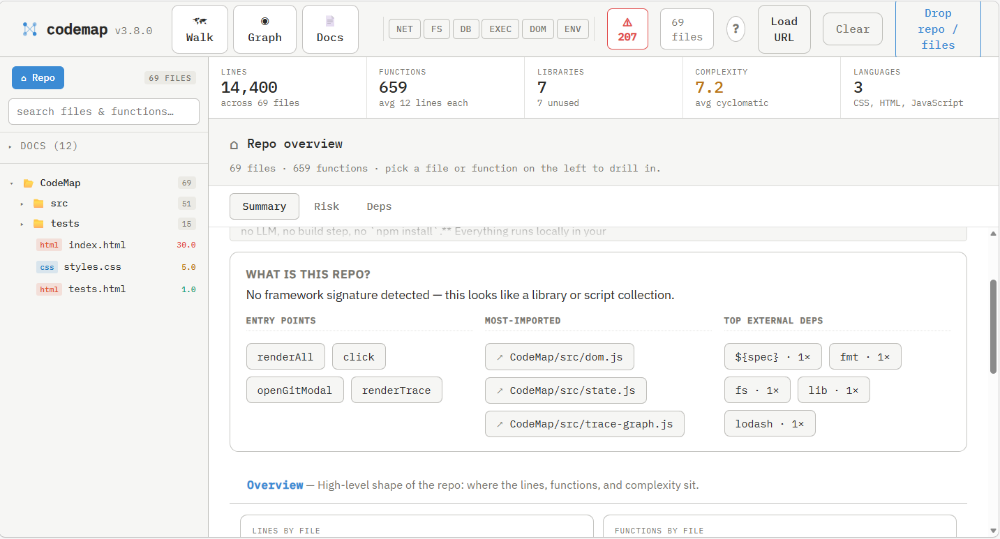

# Codemap

Browser-native, zero-dependency code intelligence. Drop a folder, get an
interactive workspace for understanding an unfamiliar codebase. **No server,
no LLM, no build step, no `npm install`.** Everything runs locally in your
browser.

**[▶ Try it live](https://mikylab.github.io/CodeMap/)** — no install, runs
entirely in your browser. Or paste a public `github.com/owner/repo` URL into
the app to explore any repo.



## Run it locally

```sh
cd CodeMap
python3 -m http.server 8000
```

Then open:
- **App:** http://localhost:8000/index.html
- **Tests:** http://localhost:8000/tests.html

(ES modules require `http://`, not `file://`. Any static server works:
`npx serve`, `php -S`, etc.)

Drag a folder onto the page — or click **Drop repo / files** to use the directory
picker. Files are read locally; nothing leaves your machine.

You can also click **Load URL** and paste a `github.com/owner/repo` or
`gitlab.com/group/repo` URL (with optional `/tree/branch` suffix). Codemap
fetches the tree and raw files directly from the host's public REST API — no
proxy or backend. GitHub anonymous calls are capped at 60/hr per IP; paste a
personal access token in the modal to raise that to 5000/hr (token is kept in
`sessionStorage` only, never sent anywhere else). Loads are capped at 500
files per repo.

## Workspace

Codemap is a single two-pane workspace, not a stack of tabs.

**Top bar** — `Walk` / `Graph` open full-screen overlays. Six effect chips
(`net · fs · db · exec · dom · env`) filter the navigator. The `⚠ N` badge
opens a full-screen Smells view; `✓ clean` if there are no findings.

**Navigator (left)** — unified tree of files (and their functions, when a
file is selected). The search box flips the navigator into flat
`file › function` results that match anywhere in the repo. Each file row
shows a smell dot (red = ≥1 warn, yellow = info-only). Effect chips above
narrow what's shown.

**Detail pane (right)** — what you're looking at depends on what's
selected on the left:

- **Nothing selected** (`⌂ Repo`) → repo overview: charts of lines /
  functions / complexity / languages, plus a Risk mode for all smells and
  a Deps mode for the library breakdown.
- **A file selected** → Summary (effects, top functions by complexity,
  smells, importers), Source, Calls (pick a fn), Risk (smells in this
  file), Deps (imports + importers).
- **A function selected** → Summary (callers, callees, smells in this fn,
  source preview), Source, Calls (full execution map DAG), Risk.

Mode chips above the detail pane are sticky — picking *Source* on one
function keeps you on Source as you navigate to siblings.

**Reading source.** Source view is interactive: call sites and resolved
import tokens are clickable and jump to their definition. Hover any link
for a card showing the target's signature, file:line, and (when present)
the first line of its docstring/JSDoc — plus an "Open Flow →" button.

**Flow** (new mode chip on functions) — answers "what does this function
consume and produce?" Params and read-effects on the left, returns and
write-effects on the right, plus the literal argument expressions every
caller passes in and what each caller binds the return value to. Distinct
from Calls, which shows reach; Flow shows arguments.

**Back / breadcrumbs.** Codemap remembers the last 20 navigation hops
within the workspace. A back button (also `Backspace` or `Alt+←`) and a
small breadcrumb trail under the title let you retrace a path through
Walk → file → function → Flow → caller without losing the thread.

## Walk, Graph, Smells, Lineage (full-screen modes)

Open from the top bar; close with **Esc** or the back button.

- **🗺 Walk** — guided tour driven by the call graph and import graph
  (with filename heuristics as fallback). Order: overview → archetype →
  entry points → first hop → core modules → boundary → complexity hotspots
  → utilities → config → orphans → external deps. Clicking any chip in a
  step jumps the workspace to that file/function and exits Walk.
- **◉ Graph** — files as nodes, imports as edges. Circular layout, node
  size ∝ √lineCount. Click a node to select it in the workspace;
  double-click to exit Graph and stay on it. Right-click two nodes to
  paint paths between them.
- **⚠ Smells** — every heuristic finding across the repo, filterable by
  kind. Click any finding to open the file in the workspace.
- **🌳 Lineage** — interactive view of stacked-branch history parsed from
  a `### Branch lineage` section in your README (or any captured doc).
  Codemap reads the hand-drawn ASCII tree of branch names, the prose
  annotations beside each branch, and any `← main is here` / `← active`
  markers. When the repo was loaded via the URL loader, each node is
  enriched with "on GitHub" / "missing on GitHub" badges and a "View on
  GitHub" link. The Lineage button only appears when a lineage section is
  found.

### Task context for coding agents / specy-road

From the **Smells** view, the *Task context* bar turns a set of paths (for
example a [specy-road](https://github.com/shanevigil/specy-road) task's
`touch_zones`) into a focused packet: the files in scope, their heuristic
findings, complexity hotspots, the call-graph neighborhood, and the calls that
cross the scope boundary (what depends on this area, and what it reaches).
Leave the paths blank for the whole repo. Choose **Markdown** (drops straight
into a specy-road `planning/` sheet) or **TOON** (token-compact for feeding an
agent directly), then **Copy** or **Download**. Everything is computed in the
browser — no server, no LLM.

The same packet is available headlessly, so a roadmap tool or CI job can build
it without a browser — see [Using Codemap with specy-road](#using-codemap-with-specy-road).

#### Keeping the packet small

An unbounded packet on a wide scope is large: the whole of this repo is roughly
39,000 tokens of Markdown. Four levers, in the order worth reaching for:

1. **Narrow the zones.** By far the biggest lever — a single file is ~500
   tokens in TOON against ~39,000 for the whole repo. If the touch zones are
   honest, this alone is usually enough.
2. **Use TOON.** Roughly half the size of Markdown for identical content.
3. **Triage first.** Dismissed findings are excluded from every future packet
   (see below).
4. **Cap what's left.** The bar exposes *Severity* (`all` / `warn+`),
   *Call graph* (`all` / `adjacent` / `none`), and *Max findings*. The live
   `~N tokens` readout next to the buttons updates as you change them.

`Call graph: adjacent` narrows the largest section to the functions the packet
already talks about — those carrying a finding, ranked as a hotspot, or sitting
on the scope boundary. Complexity hotspots and boundary calls are computed
before any narrowing, so they never change.

Every cap is disclosed in the output ("*N further finding(s) omitted by the
max-findings cap*"). A truncated packet never reads as a complete one.

## Using Codemap with specy-road

[specy-road](https://github.com/shanevigil/specy-road) keeps a roadmap graph in
your repo so humans and coding agents share one plan. It tracks *which* paths a
task owns — its `touch_zones` — but it never parses your code. Codemap parses
your code but knows nothing about tasks. Hand the same path list to both and
each does the half it's good at.

Nothing about the specy-road workflow changes. This adds one optional step
between claiming a task and writing code.

### The loop

```bash
specy-road do-next-available-task     # claims a task, writes touch_zones into
                                      # roadmap/registry.yaml, cuts feature/rm-<codename>

# turn those zones into agent context
node bin/codemap-packet.mjs \
  --format toon --min-severity warn --call-graph adjacent \
  --out planning/<node>-codemap.toon \
  src/api routes/entries

# ...implement, then finish as usual
specy-road finish-this-task --on-complete merge
```

Zones are the bare arguments and may be comma-separated, so a `touch_zones`
value pastes in verbatim. No zones means the whole repo.

Prefer the GUI? Load the repo in Codemap at the feature branch, paste the same
zones into the *Task context* bar, and **Download** into `planning/`. The two
front-ends call the same pure core, so the output is byte-identical.

### Why bother

specy-road's registry tells you which files are yours. It can't tell you what
depends on them. The packet's **Boundary calls** section is the blast radius of
the task — what outside code calls into your zone, and what your zone reaches
out to. If that section is large, the touch zones are drawn too narrow: the work
will spill into files you haven't claimed, possibly ones a teammate has. Better
to find that out before you start and widen the zones in the registry.

### Triage: don't pay for the same false positive twice

Findings are heuristic and some are wrong. Dismiss one in the Smells view and
it's gone — but browser dismissals live in `localStorage`, which a CLI run can't
see. To make triage stick across machines, agents, and CI, commit it:

```bash
# In the Smells view: dismiss the false positives, then `Export triage`.
mv ~/Downloads/codemap-triage-<slug>.json .codemap-triage.json
git add .codemap-triage.json && git commit -m "chore: codemap triage baseline"
```

`bin/codemap-packet.mjs` picks up `.codemap-triage.json` from the repo root
automatically (override with `--triage <file>`). Excluded findings are counted
in the packet and labelled *"previously triaged as false positives — do not
re-report them"*, so an agent both skips them and knows they were skipped
deliberately.

Because the file is in git, a dismissal made once by one person applies to every
later run by anyone. Teammates pick it up on `git pull`; a new dismissal is a
reviewable diff rather than invisible state in someone's browser.

**Limitation worth knowing:** a finding's identity is
`file | kind | subkind | snippet[:80]`, deliberately excluding the line number —
so inserting code above a finding keeps it dismissed, but editing the flagged
line itself changes its identity and the finding comes back. That's the
conservative choice: changed code gets re-examined.

### CLI reference

```
node bin/codemap-packet.mjs [options] [zone ...]

  --repo <dir>          repo root to scan (default: cwd)
  --format md|toon      output format (default: md)
  --triage <file>       triaged findings to exclude
                        (default: <repo>/.codemap-triage.json when present)
  --min-severity <s>    info | warn (default: info)
  --max-findings <n>    cap findings, most severe first (default: 0 = no cap)
  --snippet-chars <n>   truncate snippets; 0 = full, -1 = omit
  --call-graph <mode>   all | adjacent | none (default: all)
  -o, --out <file>      write to a file instead of stdout
  --stats               print a size summary to stderr
```

`--stats` reports what was included and dropped, which is the quickest way to
tune a scope:

```
codemap-packet: files 15/72 · findings 25/102 · fns 186/264 · chars 32955 ·
                ~tokens 8239 · triaged-out 30 · triage .codemap-triage.json
```

Requires Node (ES modules); no dependencies, no install step, no network.

## Docs tab

Markdown files at the repo root and anywhere under `docs/` are surfaced
in a **Docs** group at the top of the navigator. Clicking one renders it
in the workspace with a minimal in-tree markdown renderer. Inline
backticked file paths and `funcName()` mentions auto-link to the matching
entity, turning the README into a navigable index of the codebase. A
`### Branch lineage` section inside any doc is rendered inline as the
interactive lineage tree, not as ASCII.

## Shareable URL state

The current view — selected file, function, doc, overlay, walk step,
lineage branch, and (for URL-loaded repos) the repo origin — is encoded
in `location.hash`. Refreshing restores the view; URL-loaded sessions
produce links that another viewer can paste to land in the same place.
Local drag-drop loads encode the view but not the file contents, so
shared links only work fully for URL-loaded repos.

## Effects badges

Every function is tagged with the side-effects its body performs:
`net · fs · db · exec · dom · env`. Direct effects render as solid pills,
inherited (via callees) as outlined. Detection is import-based
(`import fs from 'fs'` → `fs`) plus patterns (`document.*` → `dom`,
`process.env` → `env`, …) run after strings and comments are stripped.
Top-bar chips filter the navigator to functions touching that effect.

Smell detectors:

- *hallucinated calls* — call sites whose name has no definition or import
- *broken imports* — relative imports that resolve to nothing
- *suspicious comments* — TODO / FIXME / HACK / "for now" / stub / mock / …
- *swallowed catches* — `catch (e) {}` / `except: pass` / silent Go err returns
- *placeholders* — `localhost`, `YOUR_API_KEY`, `foo`/`bar`, magic ports

## Path painter

Right-click a file node on the **Graph** to set the path **start**;
right-click a second to set the **end**. A chip strip shows both
endpoints and the number of paths found. Non-path nodes fade. Click
**clear ✕** to drop the painter. Setting only a start shows forward
reach; toggle **reverse** to flip to "everything that can reach here".

## Keyboard shortcuts

- **1 / 2 / 3 / 4** — toggle Walk / Graph / Smells / Lineage overlay
  (Lineage only active when a `### Branch lineage` section is found)
- **Esc** — exit full-screen overlay
- Type in the navigator search box to filter

Append `?perf=1` to the URL to log parse / analyze / render timings to the console.
Files larger than 2MB are skipped; a banner above the stat bar lists how many.

## Supported languages

JavaScript / JSX / TypeScript / TSX, Python, Go, Rust, Ruby, Java, C, C++.

## Add a language

Edit `src/lang-config.js` and add one entry:

```js
ext: {
  name: 'YourLang', color: '#hex', comment: '//',
  fn:      [/regex capturing function names/gm],
  imports: [/regex capturing imported lib/gm],
}
```

Then add at least one positive test, one import test, and one keyword
false-positive test in `tests/parser.test.js`. No other file changes needed.

## Architecture

```
CodeMap/
├── index.html              # entry — single page, no build
├── styles.css
├── src/
│   ├── lang-config.js      # LANG_CONFIG (regex per language)
│   ├── parser.js           # parseFile(name, src, path) → ParsedFile
│   ├── analyzer.js         # cross-file edges + connectivity
│   ├── walker.js           # generateWalk(state) → WalkStep[]
│   ├── trace-graph.js      # buildTraceTree(rootFn, callsByFn, fnByKey)
│   ├── ingest.js           # drag-drop / dir-picker → ParsedFile[]
│   ├── git-fetch.js        # GitHub / GitLab URL → ParsedFile[] (CORS, no server)
│   ├── git-modal.js        # "Load URL" modal UI
│   ├── state.js            # STATE singleton + mutators + indexes
│   ├── tabs.js             # complexity buckets, stdlib set
│   ├── renderer.js         # workspace dispatcher (renderAll)
│   ├── toolbar.js          # top bar: modes, effect chips, smell badge
│   ├── navigator.js        # left pane: search-first file/fn tree
│   ├── effects.js          # tagFns + reverse-BFS propagation (net/fs/db/…)
│   ├── effects-config.js   # EFFECT_LIBS, EFFECT_PATTERNS, BUILTINS
│   ├── effect-badges.js    # pill / strip render helpers
│   ├── smells.js           # 5 detectors → SmellFinding[]
│   ├── paths.js            # findPaths / findReach (BFS, simple paths)
│   ├── statbar.js / dom.js / perf.js
│   └── views/
│       ├── workspace.js    # right pane: detail modes (summary/source/…)
│       ├── fullscreen.js   # overlay shell for Walk / Graph / Smells
│       ├── overview.js     # repo charts (embedded in workspace summary)
│       ├── walk.js / graph.js / smells.js   # full-screen views
│       ├── trace-graph-view.js              # DAG renderer
│       └── paint-strip.js                   # path-painter chip strip
└── tests/                  # browser-run tests, no Node required
```

State lives in one `STATE` object. Every `render*` is idempotent and reads only
from `STATE`. All parsing is regex-based and deterministic. See `CLAUDE.md` for
philosophy, `docs/design.md` for the design notes, and `CHANGELOG.md` for the
release history. Working plans live in `docs/plans/` locally but are not
tracked in git.

## Tests

Open `tests.html`. Each test prints green ✓ / red ✗ to the page. No Node, no
npm, no installs — same runtime as the app.

## License

[MIT](LICENSE) © Mikyla Bowen
